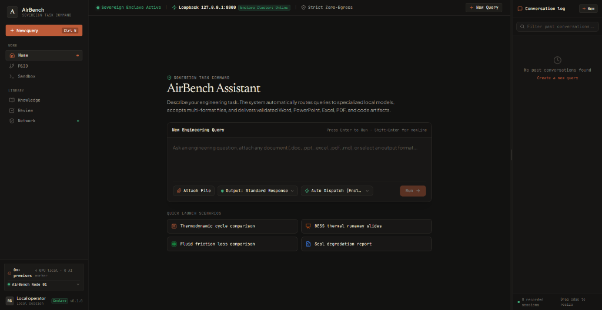
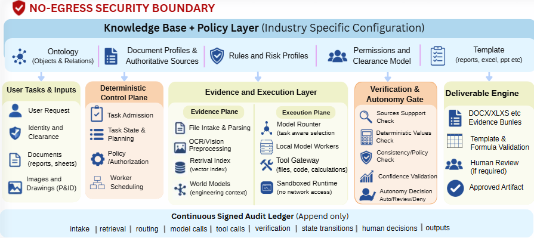

# AirBench

### Sovereign, Provenance-Preserving AI Workbench for Mission-Critical Engineering

**Plan locally. Execute deterministically. Keep every calculation grounded in authoritative evidence, and verify which conclusions were observed from signed documents and which were proposed by local models.**


*The AirBench workspace: Local on-premises enclave (4× GPU cluster, 8 AI workers) operating over loopback zero-egress (`127.0.0.1:8080`), multimodal engineering intake (.pdf, .docx, .xlsx, P&ID CAD drawings), specialized local model routing, deterministic calculation sandboxing, and real-time auditable conversation logs.*

## Overview

Industrial, public-sector, defence-linked, and government engineering organizations rely on sensitive technical specifications, Piping and Instrumentation Diagrams (P&IDs), operating manuals, inspection reports, and unreleased designs. These assets must remain strictly inside the organization's controlled physical perimeter. Standard cloud assistants create severe confidentiality risks, leak operational telemetry, and lack physical and mathematical determinism. Conversely, uncontrolled autonomous agents present ungrounded model hallucinations as authoritative engineering facts and enter unpredictable execution loops.

AirBench replaces unstructured chatbot interactions with a **sovereign, server-authoritative engineering workbench governed by deterministic control planes and append-only cryptographic auditability**. The architecture is built on a non-negotiable two-layer separation:

- **The Sector-Neutral Core Engine:** Remains identical across every deployment. It owns the deterministic agent loop, hardware-aware worker scheduling, tool sandboxing, model serving and routing, fact provenance, verification runners, consistency auditing, and ledger storage. It contains zero sector-specific rules or terminology.
- **The Signed Domain Pack:** Declares the field's ontology, entity schemas, document profiles, executable field rules, decision types, risk mappings, deliverable templates, clearance tiers, and worker requirements (`packs/refinery_psu_v0/`). A new industry is supported by authoring a signed domain pack, never by altering the core engine.

System execution is governed by three foundational invariants:

1. **Authority is deterministic, intelligence is not.** The orchestrator is plain, predictable software that owns all control flow and state. Models are stateless workers that answer one call at a time and never drive loops, mutate task state, or grant authority.
2. **Confidence, source, and clearance travel with every fact.** Facts enter the system as typed `FactEnvelope` contracts carrying immutable source document IDs, exact span coordinates, extraction methods, calibrated confidence scores, clearance tiers, and taint labels. Uploaded files enter exclusively as `UntrustedEvidence`—data that models may inspect, but that can never become instructions or policy.
3. **Everything is provable after the fact.** Consequential state transitions, model calls, tool executions, and human reviews are permanently recorded in an append-only, signed cryptographic audit ledger that can be replayed and independently checked offline.

All deliverable numbers are calculated by deterministic Python solvers in an isolated sandbox, narrative prose is drafted by qualified local models referencing named values, and the Deliverable Engine renders the results into verified Office artifacts.

---

## Architecture


*AirBench system architecture: Top: No-Egress Security Boundary enclosing the Industry-Specific Knowledge Base & Policy Layer. Middle: User Tasks & Inputs, Deterministic Control Plane, dual Evidence & Execution Layer (P&ID2Graph and vLLM / Model Router), Verification & Autonomy Gate, and Deliverable Engine. Bottom: Continuous Signed Audit Ledger.*

| Stage | Component | Role |
| :--- | :--- | :--- |
| **Knowledge Base & Policy Layer** | **Ontology (Objects & Relations)** | Defines sector-specific entity graphs, equipment hierarchies, fluid networks, and symbol taxonomies (`world_schema.yaml`, `pid_legend.yaml`). |
| **Knowledge Base & Policy Layer** | **Document Profiles & Authoritative Sources** | Enforces document revision boundaries, authoritative citation criteria, and ingestion profiles (`document_profiles.yaml`). |
| **Knowledge Base & Policy Layer** | **Rules and Risk Profiles** | Governs executable field checks, engineering limits, harm matrices, and reversibility scales (`field_rules.yaml`, `risk_mappings.yaml`). |
| **Knowledge Base & Policy Layer** | **Permissions and Clearance Model** | Role-based clearance enforcement (Confidential, Restricted, Secret) with end-to-end data taint propagation (`clearance_roles.yaml`). |
| **Knowledge Base & Policy Layer** | **Templates (Reports, Excel, PPT etc)** | Production schemas for formal Word engineering notes, Excel calculation workbooks, and PowerPoint decks (`deliverable_templates.yaml`). |
| **User Tasks & Inputs** | **User Request & Identity** | Captures user intent, binds user identity, and resolves security clearance before admitting work. |
| **User Tasks & Inputs** | **Documents & Drawings (P&ID)** | Ingests inspection reports, technical sheets, and P&ID CAD drawings as untrusted input data. |
| **Deterministic Control Plane** | **Task Admission** | Validates user clearance and admits the task into an immutable `TaskEnvelope` without model intervention. |
| **Deterministic Control Plane** | **Task State & Planning (ReWOO)** | Compiles decoupled ReWOO execution DAGs, tracks state milestones, and commits transitions deterministically. |
| **Deterministic Control Plane** | **Policy / Authorization** | Evaluates risk thresholds, tool permission scopes, and triggers human-in-the-loop review gates when required. |
| **Deterministic Control Plane** | **Worker Scheduling** | Allocates local GPU compute across parallel specialist workers or serial virtual teams based on the active `HardwareProfile`. |
| **Evidence Plane** | **File Intake & Parsing** | Single entrypoint for all file formats; computes SHA-256 manifests and emits safe representations labeled as `UntrustedEvidence`. |
| **Evidence Plane** | **P&ID2Graph / Vision OCR** | Digitizes engineering drawings into topological property graphs with symbol detection, line tracing, and OCR text binding. |
| **Evidence Plane** | **Retrieval Index (Vector Index)** | Vector and lexical search over local manuals, SOPs, and past correspondence with span-level coordinate tracking. |
| **Evidence Plane** | **World Models (Engineering Context)** | Maintains a queryable asset graph of plant equipment, fluid connections, parent-child relations, and operating parameters. |
| **Execution Plane** | **Model Router (ICLRouter / Semantic Router)** | Evaluates hard eligibility gates followed by semantic embedding classification and in-context selection for qualified models. |
| **Execution Plane** | **Local Model Workers (vLLM)** | High-throughput PagedAttention inference for open-weight models (DeepSeek-R1, Qwen-2.5-Coder, Llama-3) on local GPU clusters. |
| **Execution Plane** | **Tool Gateway** | Governed dispatch for file I/O, mathematical solvers, and code execution with strict schema validation. |
| **Execution Plane** | **Sandboxed Runtime (No Network Access)** | Ephemeral, zero-network sandboxed container executing deterministic code and physics calculations. |
| **Verification & Autonomy Gate** | **Sources Support Check** | Sentence-level NLI and span verification proving every claim maps directly to ingested source evidence. |
| **Verification & Autonomy Gate** | **Deterministic Values Check** | Compares draft figures against symbolic calculations, unit conversions, and physics equations; rejects hallucinated numbers. |
| **Verification & Autonomy Gate** | **Consistency / Policy Check** | Consistency Engine compares forming decisions to past records, surfacing material differences and flagging unjustified deviations. |
| **Verification & Autonomy Gate** | **Confidence Validation** | Calibrates confidence across evidence and extraction channels, treating uncertainty as a trigger to escalate. |
| **Verification & Autonomy Gate** | **Autonomy Decision (Auto/Review/Deny)** | Three-question governor evaluating worst-case harm, reversibility, and confidence to grade required authority. |
| **Deliverable Engine** | **DOCX/XLSX Evidence Bundles** | Builds `.docx`, `.xlsx`, and `.pptx` deliverables where code drives numbers and models supply narrative. |
| **Deliverable Engine** | **Template & Formula Validation** | Recalculates spreadsheet formulas in LibreOffice, validates cell ranges, and checks deliverable schema compliance. |
| **Deliverable Engine** | **Human Review (If Required)** | Presents interactive evidence bundles, confidence overlays, and diffs for authorized operator sign-off. |
| **Deliverable Engine** | **Approved Artifact** | Emits verified artifacts packaged with complete ledger traces, SHA-256 hashes, and cryptographic signatures. |
| **Continuous Signed Audit Ledger** | **Append-Only Event Sink** | Immutable, hash-chained ledger logging: intake, retrieval, routing, model calls, tool calls, verification, state transitions, human decisions, and outputs. |

---

## Features

- **Sovereign, Zero-Egress Boundary.** Operates entirely on-premises on local GPUs over loopback sockets (`127.0.0.1:8080`). Network egress is absent at the operating system level, ensuring zero telemetry leakage or external data exfiltration.
- **Deterministic Control vs. Stateless Workers.** The orchestrator is plain, predictable software owning all workflow state. Models are stateless workers that propose one turn at a time and never drive loops or grant authority.
- **ReWOO Decoupled Reasoning & Execution.** Compiles explicit Plan-Worker-Solver computation DAGs (Xu et al., 2023), separating planning from tool execution and eliminating uncontrolled ReAct loops and agent drift.
- **Single File Intake & Untrusted Evidence.** All files enter through a single File Intake Layer that computes SHA-256 manifests. File content is strictly marked as `UntrustedEvidence`—data that models can inspect, but that can never become instructions or policy.
- **P&ID2Graph Visual Engineering Digitization.** Converts complex Piping and Instrumentation Diagrams into topological property graphs (Rahul et al., 2024), extracting pumps, valves, instruments, and line connectivity with pixel-grounded bounding boxes.
- **Task-Aware Model Routing (Semantic Router, ICLRouter & vLLM).** Evaluates hard eligibility gates (modality, capability, clearance, context window, hardware profile) followed by sub-millisecond semantic routing (Patel et al., 2024) and in-context task allocation (Ding et al., 2024) across specialized local vLLM endpoints (Kwon et al., 2023).
- **Separate Words from Numbers.** Models write prose; the deterministic tool runtime in an isolated sandbox computes all numbers. The Deliverable Engine places values into Office templates (`.docx`, `.xlsx` with live formulas, `.pptx`). Models never type authoritative figures into deliverable fields.
- **Three-Question Autonomy Governor.** Grades autonomy by rule rather than model self-certification: evaluating worst-case harm, reversibility, and calibrated confidence to yield graded authority (allow alone, require review, or escalate to human authority).
- **Precedent & Deviation Auditing (Consistency Engine).** Evaluates forming decisions against structured historical decision records linked to World Model objects, surfacing material differences and flagging unjustified deviations from established precedent.
- **Continuous Append-Only Audit Ledger.** Cryptographic SHA-256 hash-chained ledger logging all intake manifests, model prompts, tool outputs, verification gates, state transitions, and human sign-offs for independent offline compliance audits.

---

## Using AirBench

### Enclave Specification

| Requirement | Value |
| :--- | :--- |
| **Deployment Target** | Air-gapped workstation, on-premises server, or sovereign enclave cluster |
| **Compute & Acceleration** | 1× to 4× NVIDIA GPUs (RTX 4090, A100, H100) running local vLLM / TensorRT-LLM |
| **Network Invariant** | Strict Zero-Egress, local loopback (`127.0.0.1:8080`), isolated IPC |
| **Document Intake** | PDF, DOCX, XLSX, PPTX, Markdown, P&ID CAD drawings (.png, .jpg, .dxf) |
| **Serving Backends** | vLLM (PagedAttention), NVIDIA NIM, llama.cpp / GGUF local engines |
| **Routing Framework** | Semantic Router (embedding classification) + ICLRouter (demonstration-based allocation) |
| **Desktop Interface** | Tauri 2.0 shell, React 19, TypeScript, Dark Engineering Cockpit |
| **Deliverable Formats** | Word (.docx), Excel (.xlsx with formulas), PowerPoint (.pptx), verified code packages |

### Quickstart

#### 1. Python Enclave Runtime
```bash
# Initialize isolated Python environment
python -m venv .venv

# Activate environment
# Linux/macOS:
source .venv/bin/activate
# Windows PowerShell:
# .venv\Scripts\Activate.ps1

# Install core runtime and test harnesses
python -m pip install -e ".[test]"

# Run verification test suite
pytest
```

#### 2. Start Local Model Serving (vLLM)
```bash
# Launch qualified model workers via vLLM on local GPU cluster
vllm serve Qwen/Qwen2.5-Coder-32B-Instruct --port 8000 --tensor-parallel-size 2
vllm serve deepseek-ai/DeepSeek-R1-Distill-Qwen-14B --port 8001 --tensor-parallel-size 2
```

#### 3. Launch Sovereign Desktop Cockpit
```bash
cd apps/desktop
npm ci
npm run check:contracts
npm run tauri:dev
```

---

## The AirBench Workspace

The desktop application provides a sovereign, high-density engineering command center:

- **Enclave Status Bar:** Real-time monitoring of enclave security (`Sovereign Enclave Active`), loopback transport (`127.0.0.1:8080`), cluster health (`Enclave Cluster: Online`), and zero-egress enforcement.
- **Left Navigation Rail:** Dedicated views for the main command cockpit (`Home`), schematic topology viewer (`P&ID`), isolated execution shell (`Sandbox`), local manuals (`Knowledge`), verification queue (`Review`), and network firewall inspector (`Network`).
- **Cluster Hardware Monitor:** Displays active local compute topology (e.g. `4 GPU local · 8 AI workers`, `AirBench Node 01`, `Enclave v0.1.0`).
- **Sovereign Task Command:** Unified query input supporting multi-format document attachment (.pdf, .docx, .xlsx, .ppt, .md), output format selection, auto-dispatch enclave routing, and execution controls.
- **Audit & Conversation Drawer:** Sequence-numbered ledger events, ReWOO task progress, verification badges, and human-in-the-loop review checkpoints.

---

## Repository Structure

```text
AirBench/
├── apps/
│   └── desktop/                  # Sovereign Desktop UI (Tauri 2, React 19, TypeScript)
│       ├── src/
│       │   ├── features/         # Workspace, P&ID viewer, Sandbox, Review, Network
│       │   ├── components/       # High-density dark engineering design system
│       │   └── contracts.ts      # TypeScript interfaces synced with backend schemas
│       ├── src-tauri/            # Rust shell, loopback IPC, zero-egress enforcement
│       └── public/demo-fixtures/ # Industrial P&ID drawings, inspection reports
├── src/
│   ├── airbench/                 # Sector-neutral Python runtime & services
│   │   ├── orchestration/        # Deterministic control plane & ReWOO state machine
│   │   ├── node/                 # Node API service, hardware admission, no-egress gates
│   │   ├── intake/               # File Intake Layer & P&ID2Graph visual pipeline
│   │   │   └── pid/              # Symbol detection, line tracing, topology builder
│   │   ├── knowledge/            # Vector retrieval, chunking, and World Model engine
│   │   ├── tools/                # Governed calculation tools and sandbox execution
│   │   ├── verification/         # Conformal prediction, physics & formula validators
│   │   └── delivery/             # Word, Excel, and PowerPoint deterministic renderers
│   └── contracts/                # Provider-neutral typed schemas (FactEnvelope, etc.)
│       ├── model/                # ModelRouter, ModelRegistry, vLLM/NIM adapters
│       ├── execution/            # ReWOO execution plans, tool action schemas
│       └── provenance/           # Audit ledger events, signatures, hash chains
├── packs/
│   └── refinery_psu_v0/          # Industrial reference domain pack
│       ├── world_schema.yaml     # Equipment ontology and fluid relations
│       ├── pid_legend.yaml       # P&ID symbol definitions and connection rules
│       ├── field_rules.yaml      # Engineering safety constraints and limits
│       └── deliverable_templates.yaml # Office document styling and layout rules
├── tests/                        # Contract, unit, integration, and security suites
├── docs/
│   ├── assets/                   # Architecture diagrams and workspace screenshots
│   ├── foundations/              # Architectural source of truth (Specs 01-10)
│   ├── runtime/                  # Router review, model rosters, harness specifications
│   └── assurance/                # Model qualification, sovereignty, and audit ledger
├── AGENTS.md                     # Mandatory coding-agent instructions and invariants
└── pyproject.toml                # Python package and dependency configuration
```

---

## Data and Credits

- **vLLM Project:** High-throughput PagedAttention inference engine powering local open-weight model execution.
- **Tauri Framework:** Secure, lightweight, memory-efficient desktop runtime for offline sovereign enclaves.
- **python-docx, openpyxl, & python-pptx:** Deterministic office deliverable synthesis engines.
- **PyTorch & HuggingFace Transformers:** Local vision, OCR, and embedding pipelines.

---

## References

- **vLLM:** Kwon, W., Li, Z., Zhuang, S., Sheng, Y., Zheng, L., Yu, C. H., Gonzalez, J. E., Zhang, H. and Stoica, I. (2023). *Efficient Memory Management for Large Language Model Serving with PagedAttention.* Proceedings of the 29th ACM Symposium on Operating Systems Principles (SOSP '23).
- **Semantic Router:** Patel, A. et al. (2024). *Semantic Router: Superfast and Deterministic Decision-Making for LLMs.* Aurelio AI.
- **PID2GRAPH:** Rahul, A., Mani, K. et al. (2024). *PID2GRAPH: Deep Learning-based Digitization and Topological Graph Extraction of Piping and Instrumentation Diagrams.* IEEE Transactions on Pattern Analysis and Machine Intelligence / Computer-Aided Chemical Engineering.
- **ICLRouter:** Ding, J. et al. (2024). *ICLRouter: In-Context Learning Router for Dynamic Task-Specific Model Allocation and LLM Cascading.* arXiv:2407.21448.
- **ReWOO:** Xu, B., Peng, Z., Lei, B., Mukherjee, S., Gao, Y. and Peng, D. (2023). *ReWOO: Decoupling Reasoning from Observations for Efficient and Accountable Augmented Language Models.* arXiv:2305.18323.
