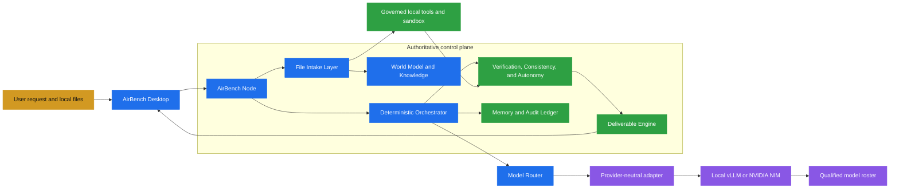

<div align="center">

# AirBench

### Sovereign AI workbench for accountable sensitive knowledge work

**Plan locally. Execute responsibly. Verify every result. Prove every consequential step.**

[](pyproject.toml)
[](apps/desktop/)
[](apps/desktop/)
[](docs/assurance/memory_and_audit_ledger.md)
[](docs/README.md)

</div>

---

<div align="center">

**[Overview](#overview)** | **[Why AirBench](#why-airbench)** | **[Architecture](#architecture)** | **[USPs](#core-usps)** | **[Setup](#setup)** | **[Repository](#repository-layout)** | **[Project state](#project-state)**

</div>

---

## Overview

AirBench is a self-hosted AI worker for routine but sensitive organizational work. It is designed for industrial, public-sector, defence-linked, and government environments where documents, calculations, source code, correspondence, and unreleased designs must remain inside the organization's controlled network.

AirBench is intended to feel like a modern desktop AI workbench, while its execution model is stricter than ordinary chat. A request becomes a governed task with an explicit plan, controlled actions, verification evidence, human approval where required, real deliverables, and a locally recorded audit trail.

## Why AirBench

Cloud assistants are convenient, but many organizations cannot send their working data to an external service. Manual work preserves confidentiality but consumes expert time and makes the reasoning and approval trail difficult to reproduce.

AirBench addresses the gap with a local system that combines:

- a desktop interface for non-technical users;
- local and remote-on-premises AirBench Nodes;
- multiple qualified open-weight models behind one routing boundary;
- local document, OCR, vision, retrieval, calculation, and sandbox tools;
- structured execution visibility instead of an opaque one-shot answer;
- deliverables and evidence that can be reviewed by a person and audited later.

## What AirBench is, and is not

| AirBench is | AirBench is not |
| --- | --- |
| A sovereign workbench that runs within an organization's infrastructure | A cloud chatbot or a proxy that quietly sends data to a public model |
| A bounded worker that can carry a task across multiple controlled steps | An unbounded agent that can invent tools or grant itself authority |
| A provider-neutral runtime for qualified local models | A product hard-coded around one model, vendor, or inference server |
| A provenance and evidence system for accountable work | A text generator that asks users to trust unsupported prose |

## Architecture



The core engine is sector-neutral. Field-specific behavior belongs in a signed domain pack behind its contract. The orchestrator owns state, control flow, retries, fallback, and completion. Models are stateless workers that answer one call and never drive the loop.

Files and other uploaded content are untrusted data, never instructions. Authoritative deliverable numbers come from deterministic computation. Runtime code, sandbox code, model paths, and untrusted-file paths are designed without external network access.

Start with the [architecture map](docs/README.md) and read the [foundation documents](docs/foundations/README.md) in order.

## Core USPs

These are the product differentiators AirBench is being built to prove, not marketing claims that replace acceptance evidence.

| USP | What makes it meaningful | How it is kept honest |
| --- | --- | --- |
| **Sovereign execution** | Confidential files, model inference, tools, and records stay within the organization's controlled deployment boundary. | Offline startup, no-egress checks, network monitoring, and deployment evidence are release gates. |
| **End-to-end accountable work** | The worker can move from a request to intake, planning, authorized execution, verification, and a usable deliverable. | Each consequential transition has a typed state, permission decision, and ledger record. |
| **Deterministic control plane** | The system can use capable models without allowing a model to control the loop, state, retries, or authority. | The Node and orchestrator own transitions; model calls return bounded proposals. |
| **Provenance that survives the workflow** | Facts remain connected to source, confidence, clearance, taint, timestamps, derivation, and ledger references. | Contracts and boundary tests reject metadata loss or clearance widening. |
| **Domain-pack separation** | The same engine can support different sectors without embedding refinery, PSU, defence, or government assumptions in core code. | Domain knowledge enters only through the domain-pack contract. |
| **Model-neutral intelligence** | Different tasks can use different qualified local models, while new models and backends can be registered later. | The agent talks to the Model Router, never directly to a model endpoint. |
| **One controlled intake path** | PDFs, images, scans, drawings, and other files share the same manifest, trust, and provenance boundary. | Bulk ingestion and query uploads use the File Intake Layer with different declared switches. |
| **Deliverables over chat** | The output can be an approval note, presentation, workbook, calculation, or working code package. | Values are computed, artifacts are rendered and checked, and evidence travels with the output. |
| **Visible but safe execution trace** | Users can understand the plan, current step, tool activity, evidence, questions, approvals, and outcome as work proceeds. | The UI shows structured provenance and status, not fabricated activity or private model chain-of-thought. |

## Request lifecycle

1. **Create the task.** The user describes the outcome and attaches local files through the desktop application.
2. **Intake the files.** The File Intake Layer stores immutable input identities, extracts safe representations, and marks all uploaded content as untrusted data.
3. **Build context.** The World Model and Knowledge and Retrieval layers expose source-bounded facts, evidence, and retrieval results with their metadata intact.
4. **Plan the work.** The orchestrator creates a bounded plan, expected outputs, required capabilities, and policy-relevant risk information.
5. **Review and authorize.** The user sees the plan and approves, edits, rejects, or answers a clarification question before consequential work proceeds.
6. **Execute deterministically.** The orchestrator selects the next step, admits the required tools and model capability, records the decision, and handles retries or escalation.
7. **Route each model call.** The Model Router chooses a qualified model based on task capability, clearance, health, hardware, and routing policy. A user preference can only narrow choices allowed by the Node.
8. **Verify and reconcile.** Verification and consistency checks compare claims, calculations, sources, and expected outputs. Failures stop, retry, downgrade, or request human review according to policy.
9. **Build the deliverable.** The Deliverable Engine creates the requested artifact. Numbers come from deterministic computations and are referenced by name in model-authored prose.
10. **Review, sign off, and remember.** The user reviews the artifact and evidence, signs off where required, receives the outcome, and can inspect the ledger-backed trace.

Every model call, tool call, decision, state transition, and human sign-off is written to the append-only, signed Memory and Audit Ledger. The desktop application receives server-authoritative snapshots and sequence-numbered events from the AirBench Node.

## Trust boundaries and sovereignty

| Boundary | Responsibility |
| --- | --- |
| **Desktop application** | Presents state, captures user commands, displays evidence, and connects only to an approved AirBench Node. |
| **AirBench Node** | Owns admission, authorization, orchestration, routing, tools, verification, provenance, artifacts, and ledger writes. |
| **File Intake Layer** | The only parser and normalizer for uploaded or ingested files. It emits manifests and safe representations for downstream work. |
| **Models** | Stateless workers. They propose text, structured plans, classifications, or tool arguments for one call; they do not grant authority or drive loops. |
| **Domain pack** | Supplies sector-specific vocabulary, policies, workflows, schemas, and evaluators through an explicit contract. |
| **Ledger** | Provides append-only, signed, replayable evidence for consequential activity. |

The sovereignty claim is operational: the deployment must demonstrate that the running desktop, Node, model serving, file intake, tools, and sandbox make no unauthorized external contact. A README statement alone is not proof.

## Supported work and outputs

The first vertical slice is aimed at practical sensitive work such as:

- reviewing scanned inspection reports and extracting findings;
- drafting an approval note grounded in the supplied evidence;
- preparing board or review material;
- performing calculations with visible steps and deterministic values;
- reviewing photographs, scans, and other visual material through local vision and OCR components;
- creating, running, and verifying internal tool code in a governed sandbox;
- searching local manuals, SOPs, past correspondence, and other approved knowledge sources.

The intended outputs are real files and evidence packages, including Word documents, PowerPoint presentations, Excel workbooks, calculation records, code artifacts, safe previews, and audit traces.

## Model and serving strategy

The model boundary is deliberately provider-neutral:

```text
AirBench Agent -> Model Router -> Provider Adapter -> vLLM or NVIDIA NIM -> Qualified Local Model
```

The registry describes each model's capabilities, modalities, context length, resource requirements, priority, health, qualification status, and endpoint identity. Automatic routing is always available. A manual model choice is an allowed preference within the Node's capability, clearance, qualification, and hardware policy, not a bypass around those controls.

The same boundary can later register reasoning, coding, vision, OCR, embedding, reranking, or engineering-specific models without redesigning the orchestrator.

## Local vertical slice target

The first meaningful demonstration is not a mock chat screen. It is a locally running, inspectable work cycle:

1. create a task from the desktop UI;
2. upload a scanned inspection report through File Intake;
3. preview the safe extracted representation;
4. review and authorize the generated plan;
5. execute bounded retrieval, extraction, drafting, and verification steps;
6. show structured live progress, evidence, questions, approvals, and provenance;
7. generate and download an approval-note document;
8. run a separate coding task in the governed sandbox and verify its result;
9. inspect the ledger-backed trace and capture no-egress evidence.

GPU performance, production packaging, native Linux isolation, and fleet-scale deployment are separate acceptance gates. They must be demonstrated with the appropriate hardware and environment, not inferred from a local mock or unit test.

## Setup

### Python runtime

```bash
python -m venv .venv

# macOS or Linux
source .venv/bin/activate

# Windows PowerShell
# .venv\Scripts\Activate.ps1

python -m pip install -e ".[test]"
pytest
```

### Desktop application

```bash
cd apps/desktop
npm ci
npm run check:contracts
npm run build
```

For local desktop development, use `npm run tauri:dev`. Desktop validation commands and their evidence boundaries are documented in [the desktop validation guide](apps/desktop/validation/README.md) and the [frontend documentation map](docs/desktop/README.md).

## Repository layout

```text
.
├── src/
│   ├── airbench/             # sector-neutral runtime and services
│   └── contracts/            # typed provider-neutral contracts and schemas
├── apps/
│   └── desktop/              # Tauri shell, React UI, Rust boundary, and desktop tests
├── packs/                    # domain-pack declarations and examples
├── tests/                    # Python contract, unit, integration, and acceptance tests
├── acceptance/               # release gates, fixtures, expected evidence, and traces
├── docs/                     # architectural source of truth and frontend documentation
├── engineering_records/      # planning and historical engineering records
├── scripts/                  # repository maintenance and contract-generation tools
├── AGENTS.md                 # mandatory coding-agent entrypoint
└── pyproject.toml            # Python package and test configuration
```

## Documentation map

| Collection | Purpose | Start here |
| --- | --- | --- |
| [Foundations](docs/foundations/) | The first ten system architecture documents | [Architecture design](docs/foundations/01_architecture_design.md) |
| [Runtime](docs/runtime/) | Harness, orchestration, serving, routing, and backend planning | [Backend development plan](docs/runtime/backend_development_plan.md) |
| [Assurance](docs/assurance/) | Qualification, verification, security, provenance, and the audit ledger | [Sovereignty and security](docs/assurance/sovereignty_and_security.md) |
| [Desktop](docs/desktop/) | Tauri architecture, UI design, contracts, workflows, and validation | [Desktop README](docs/desktop/README.md) |
| [Delivery](docs/delivery/) | Deliverables, packaging, deployment, and scale | [Documentation map](docs/README.md) |
| [Operations](docs/operations/) | Agent workflow and execution guidance | [Agent development workflow](docs/operations/agent_development_workflow.md) |
| [Future](docs/future/) | Deliberately deferred full-fledge requirements | [Future requirements](docs/future/future_full_fledged_must_have.md) |

## Development workflow

AirBench is developed in Python for the backend and contracts, with a Tauri desktop application and React plus TypeScript presentation layer. Backend and frontend work can progress in parallel, but both must preserve server-authoritative state, approval, provenance, clearance, taint, and audit boundaries.

Before changing code:

1. read [AGENTS.md](AGENTS.md);
2. inspect the GitHub issue, its milestone, blockers, sibling issues, and acceptance criteria;
3. read the relevant architecture document bundle;
4. state the understanding checkpoint, contracts, dependencies, tests, and expected files;
5. implement a small vertical slice with red, green, refactor testing;
6. run the applicable architecture, contract, provenance, ledger, intake, router, security, and frontend guards;
7. update the issue with evidence before merge or push.

The repository-owned skills live in `.agents/skills/`. Start with `airbench-start-task`, then use the smallest relevant set of planning, development, guard, review, validation, and finish skills.

## Project state

AirBench is under active development. The architecture and contracts define the intended system, while implementation and acceptance evidence are being built in vertical slices. The issue tracker and acceptance records are authoritative for what is genuinely complete.

The first release target is a local end-to-end workbench that proves task creation, File Intake handoff, plan authorization, qualified model routing, governed tool execution, verification, deliverable generation, visible provenance, and no-egress operation. Production packaging, hardware-specific qualification, native sandbox isolation, and fleet deployment remain explicit gates rather than implied capabilities.

## Design principles

1. **The core engine stays sector-neutral.** Put field knowledge in the domain pack contract.
2. **The orchestrator owns the loop.** Models answer one call and never own state or control flow.
3. **Provenance is created early and never dropped.** Source, confidence, clearance, taint, and derivation cross every boundary.
4. **Untrusted content is data.** Uploaded and ingested documents never become instructions.
5. **There is one File Intake Layer.** No secondary parser may bypass its trust and provenance controls.
6. **Numbers are computed.** Model prose references named values produced by deterministic computation.
7. **Consequential activity is remembered.** Model calls, tools, decisions, and sign-offs enter the append-only ledger.
8. **The user sees meaningful work.** The UI exposes structured plan, status, evidence, questions, approvals, and outcome without inventing activity.
9. **Offline is proved, not promised.** No-egress evidence is part of acceptance.
10. **A passing unit test is not a deployment claim.** Hardware, packaging, isolation, and operator workflows need their own evidence.
